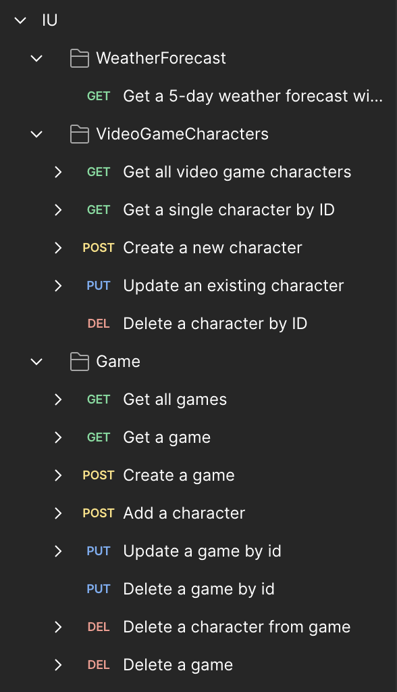
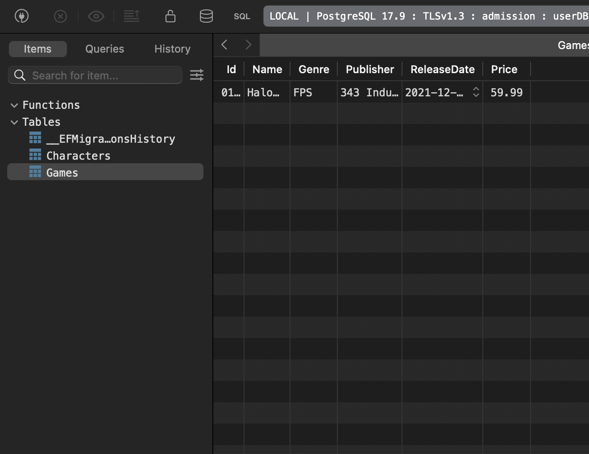

# API Documentation

Base URL: `https://localhost:5293`

## Response Format

All endpoints return a unified `ApiResponse<T>` wrapper:

```json
{
  "success": true,
  "message": "Success",
  "data": { ... },
  "errors": null
}
```

| Field | Type | Description |
|-------|------|-------------|
| `success` | bool | `true` if the request succeeded |
| `message` | string | Human-readable status message |
| `data` | T? | Response payload (null on failure) |
| `errors` | string[]? | List of error details (null on success) |

---

## Endpoints Overview

### VideoGameCharacters

| Method | Path | Description |
|--------|------|-------------|
| GET | `/api/VideoGameCharacters` | Get all characters |
| GET | `/api/VideoGameCharacters/{id}` | Get character by ID |
| POST | `/api/VideoGameCharacters` | Create a new character |
| PUT | `/api/VideoGameCharacters/{id}` | Update a character |
| DELETE | `/api/VideoGameCharacters/{id}` | Delete a character |

### Games

| Method | Path | Description |
|--------|------|-------------|
| GET | `/api/Games` | Get all games |
| GET | `/api/Games/{id}` | Get game by ID |
| POST | `/api/Games` | Create a new game |
| PUT | `/api/Games/{id}` | Update a game |
| DELETE | `/api/Games/{id}` | Delete a game |
| POST | `/api/Games/{gameId}/characters/{characterId}` | Add a character to a game |
| DELETE | `/api/Games/{gameId}/characters/{characterId}` | Remove a character from a game |

### Sample



---

## Detailed Documentation

- [VideoGameCharacters](./video-game-characters.md)
- [Games](./games.md)

## Database

