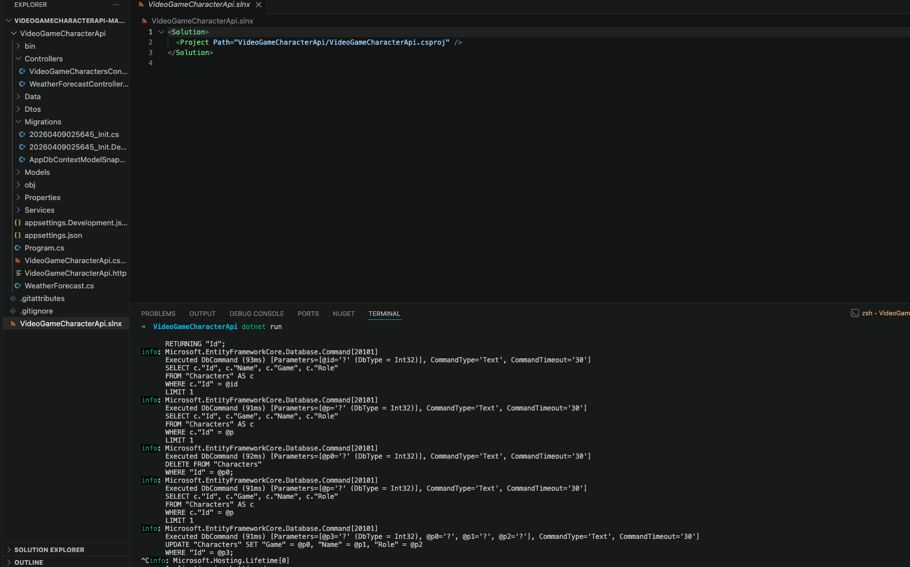
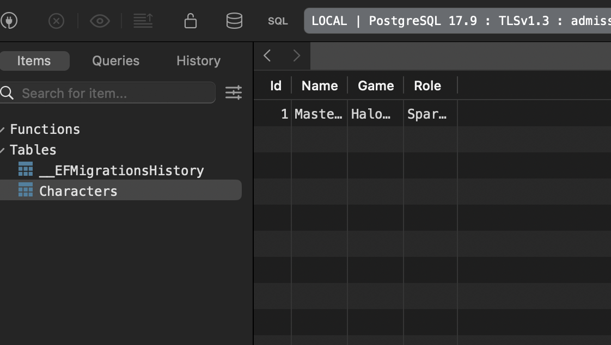

# API Documentation

Base URL: `https://localhost:{port}`

## Endpoints Overview

### VideoGameCharacters

| Method | Path | Description |
|--------|------|-------------|
| GET | `/api/VideoGameCharacters` | Get all characters |
| GET | `/api/VideoGameCharacters/{id}` | Get character by ID |
| POST | `/api/VideoGameCharacters` | Create a new character |
| PUT | `/api/VideoGameCharacters/{id}` | Update a character |
| DELETE | `/api/VideoGameCharacters/{id}` | Delete a character |

### WeatherForecast

| Method | Path | Description |
|--------|------|-------------|
| GET | `/WeatherForecast` | Get 5-day weather forecast (sample data) |

## Detailed Documentation

- [VideoGameCharacters](./video-game-characters.md)
- [WeatherForecast](./weather-forecast.md)

## Database
