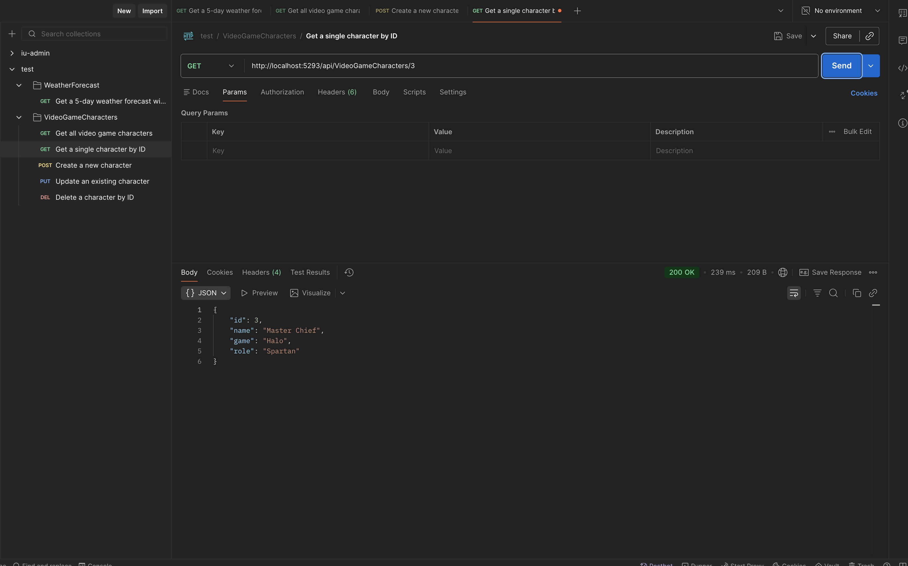
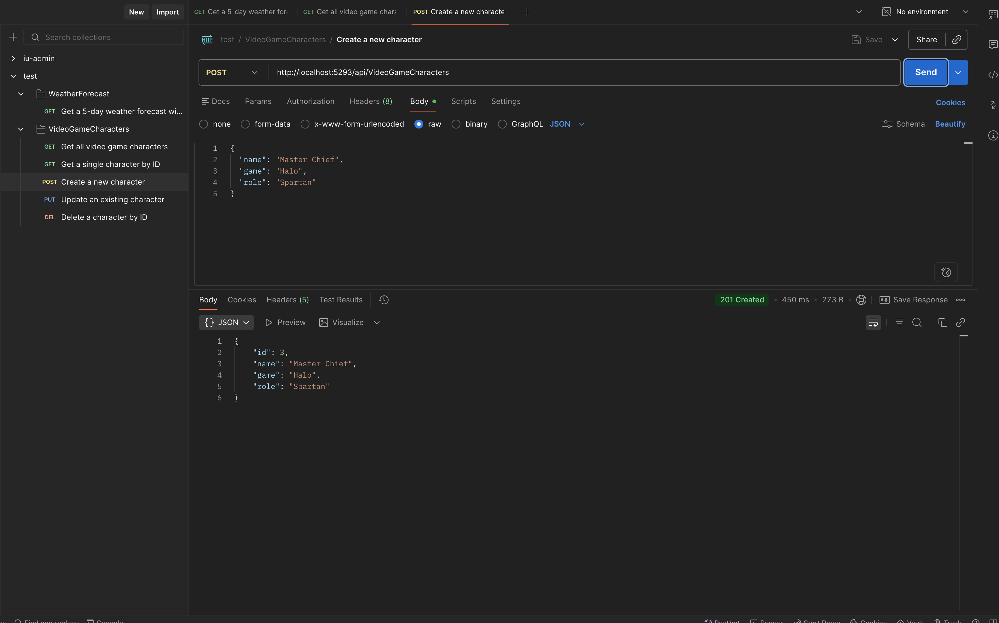
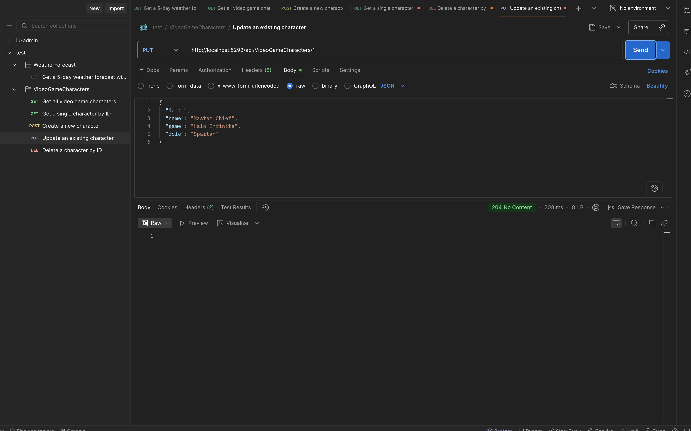

# VideoGameCharacters API

Base path: `/api/VideoGameCharacters`

---

## GET /api/VideoGameCharacters

Get all video game characters.


**Request:** No body required.

**Response `200 OK`:**
```json
[
  {
    "id": 1,
    "name": "Master Chief",
    "game": "Halo",
    "role": "Spartan"
  },
  {
    "id": 2,
    "name": "Geralt of Rivia",
    "game": "The Witcher 3",
    "role": "Witcher"
  }
]
```

---

## GET /api/VideoGameCharacters/{id}

Get a single character by ID.



**Path Parameter:**
- `id` (int) — The character's ID.

**Response `200 OK`:**
```json
{
  "id": 1,
  "name": "Master Chief",
  "game": "Halo",
  "role": "Spartan"
}
```

**Response `404 Not Found`:**
```
"Character with the given Id was not found."
```

---

## POST /api/VideoGameCharacters

Create a new character.



**Request Body (`application/json`):**
```json
{
  "name": "Master Chief",
  "game": "Halo",
  "role": "Spartan"
}
```

| Field | Type | Required | Description |
|-------|------|----------|-------------|
| `name` | string | Yes | Character name |
| `game` | string | Yes | Game title |
| `role` | string | Yes | Character role/class |

**Response `201 Created`:**
```json
{
  "id": 1,
  "name": "Master Chief",
  "game": "Halo",
  "role": "Spartan"
}
```

---

## PUT /api/VideoGameCharacters/{id}

Update an existing character.



**Path Parameter:**
- `id` (int) — The character's ID.

**Request Body (`application/json`):**
```json
{
  "id": 1,
  "name": "Master Chief",
  "game": "Halo Infinite",
  "role": "Spartan"
}
```

| Field | Type | Required | Description |
|-------|------|----------|-------------|
| `id` | int | Yes | Must match the path `{id}` |
| `name` | string | Yes | Character name |
| `game` | string | Yes | Game title |
| `role` | string | Yes | Character role/class |

**Response `204 No Content`:** Update successful.

**Response `404 Not Found`:**
```
"Character with the given Id was not found."
```

---

## DELETE /api/VideoGameCharacters/{id}

Delete a character by ID.

**Path Parameter:**
- `id` (int) — The character's ID.

**Request:** No body required.

**Response `204 No Content`:** Deletion successful.

**Response `404 Not Found`:**
```
"Character with the given Id was not found."
```
